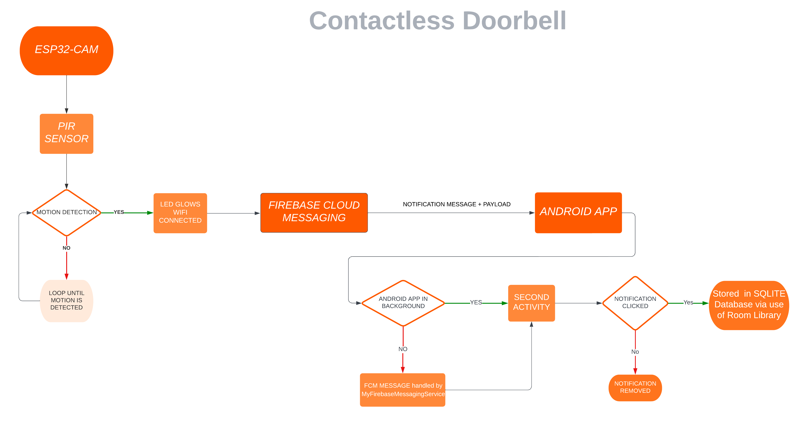

# Contact Less Doorbell
In Wake of Covid-19 , There is an urgent need to convert our traditional bell into a contactless bell, which eliminates contact and thus reduces the likelihood of spread. 
 
 

# Parts Used

* 1 x ESP32 S-CAM-CH340 Development Test Board (WiFi+ Bluetooth Module) ESP32 Serial Port with OV2640 Camera
* 1 x 20 cm Male to Female Jumper wire (3 pcs)
* 1 x 20 cm Male to Male Jumper wire (1 pc)
* 1 x MB102 830 Points Solderless Prototype PCB Breadboard 
* 1  RYB LED 
* 1 x 220-ohm Resister(1p pcs)
* 1 x HC-SR501 PIR sensor with Jumper at back for trigger

 
 

# ESP32-CAM Circuit Diagram 

 
 

# Working of Project

https://user-images.githubusercontent.com/77577353/197324879-39d51113-b1f0-4d42-91da-211d66e3ba62.mp4

Android App has functionality of displaying Device Registration Token (Firebase FCM device token) which should be used in esp32 DEVICE_REGISTRATION_ID_TOKEN parameter for sending notifications to that android device 

https://user-images.githubusercontent.com/77577353/197324649-7af5d8f4-5e6f-4c75-91ae-e109d72c4c97.mp4

This project involves using ESP32-Cam with PIR Motion Detection Sensor which sends a User Notification on Android App if someone comes near the doorbell . It Uses Firebase Cloud Messaging to send push notification to User's android app . If user wants to store the records of doorbells, notifications should be clicked , It will then store the time and date into local Database implemented via Room Library on User's smartphone.
